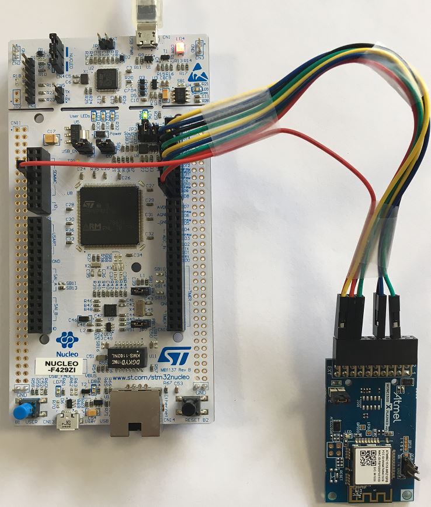
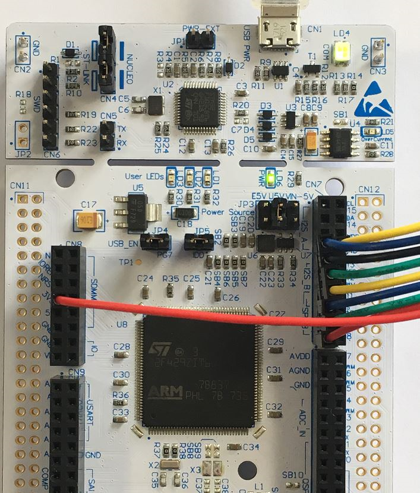
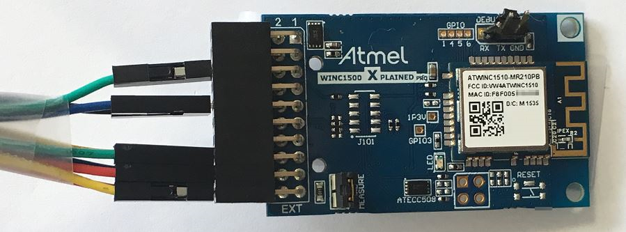
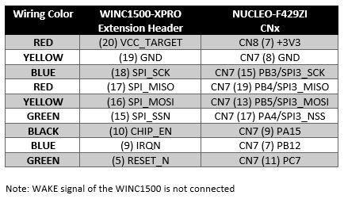

# STM32F429ZI_NUCLEO_144_STATION_MODE
> Adding Embedded Wi-Fi Connectivity to a Cortex-M4 Microcontroller

This sample application code demonstrates how to enable Station (STA) mode and connect to an Acess Point (AP)
using the Microchip WINC1500 Wi-Fi module connected to an STM32F429ZI Host MCU.

For more information on Microchip WINC1500 Wi-Fi Module, visit Microchip webpage: http://www.microchip.com/atwinc1500
For more information on STM32F249ZI MCU, visit ST webpage: https://www.st.com/en/microcontrollers/stm32f429zi.html




## Software

- Atollic TrueSTUDIO v9.0.0 has been used on Windows for this project. </br>
To download the IDE, visit http://www.atollic.com/truestudio/

- TeraTerm terminal emulator </br>
To download the program, visit https://ttssh2.osdn.jp/index.html.en


## Hardware Setup

STM32 Nucleo-144 development board with STM32F429ZI MCU
STM32 Nucleo-144 board does not require any debug probe as it integrates the ST-LINK/V2-1 debugger/programmer.</br>
The USB connector CN1 will be used to power supply the board, program the MCU and interact with the serial console.</br>
More information available:  https://www.st.com/en/evaluation-tools/nucleo-f429zi.html


The ATWINC1500-XPRO extension board allows you to evaluate the Microchip WINC1500 WiFi module.</br>
More information available: https://www.microchip.com/DevelopmentTools/ProductDetails/ATWINC1500-XPRO





## Tutorial

- Start Atollic TrueSTUDIO IDE

- Import an existing project

- Browse your hard disk to select the project folder of this sample code

- Open inc/main.h to change the AP credentials:</br>
```
/** Wi-Fi Settings */
#define MAIN_WLAN_SSID        "DEMO_AP" /* < Destination SSID */
#define MAIN_WLAN_AUTH        M2M_WIFI_SEC_WPA_PSK /* < Security manner */
#define MAIN_WLAN_PSK         "12345678" /* < Password for Destination SSID */
```
- Open src/main.c file to observe the initialization of the Wi-Fi driver, the callback and the the scan request:</br>
```
  /* Initialize Wi-Fi driver with data and status callbacks. */
  param.pfAppWifiCb = wifi_cb;
  ret = m2m_wifi_init(&param);
  if (M2M_SUCCESS != ret) {
	  printf("main: m2m_wifi_init call error!(%d)\r\n", ret);
	  while (1) {
	  }
  }
  
	/* Request scan. */
	m2m_wifi_request_scan(M2M_WIFI_CH_ALL);
```
- When the scan is done, the callback "wifi_cb" is executed, the code is looking for AP configured in main.h and try to connect to it:</br>
```
	case M2M_WIFI_RESP_SCAN_RESULT:
	{
		tstrM2mWifiscanResult *pstrScanResult = (tstrM2mWifiscanResult *)pvMsg;
		uint16_t demo_ssid_len;
		uint16_t scan_ssid_len = strlen((const char *)pstrScanResult->au8SSID);

		/* display founded AP. */
		printf("[%d] SSID:%s\r\n", scan_request_index, pstrScanResult->au8SSID);

		num_founded_ap = m2m_wifi_get_num_ap_found();
		if (scan_ssid_len) {
			/* check same SSID. */
			demo_ssid_len = strlen((const char *)MAIN_WLAN_SSID);
			if
			(
				(demo_ssid_len == scan_ssid_len) &&
				(!memcmp(pstrScanResult->au8SSID, (uint8_t *)MAIN_WLAN_SSID, demo_ssid_len))
			) {
				/* A scan result matches an entry in the preferred AP List.
				 * Initiate a connection request.
				 */
				printf("Found %s \r\n", MAIN_WLAN_SSID);
				m2m_wifi_connect((char *)MAIN_WLAN_SSID,
						sizeof(MAIN_WLAN_SSID),
						MAIN_WLAN_AUTH,
						(void *)MAIN_WLAN_PSK,
						M2M_WIFI_CH_ALL);
				break;
			}
		}

		if (scan_request_index < num_founded_ap) {
			m2m_wifi_req_scan_result(scan_request_index);
			scan_request_index++;
		} else {
			printf("can not find AP %s\r\n", MAIN_WLAN_SSID);
			m2m_wifi_request_scan(M2M_WIFI_CH_ALL);
		}

		break;
	}
```
- Open TeraTerm program a create a serial connection with the following parameters:</br>
115200bps, 8 bit, no parity, 1 stop bit

- Build project, if everything is set correctly build finishes without errors</br>

- Open the Debug Configurations window and make sure ST-LINK is selected as a debug probe with SWD interface</br>

- Start debug/program the code into your board</br>

- Run the code

- You should now be able to see serial traces on the TeraTerm console

